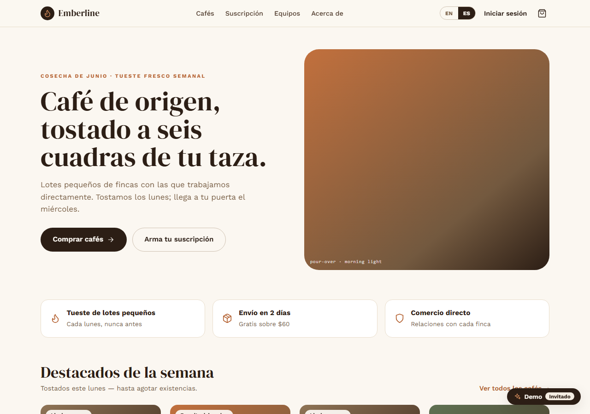
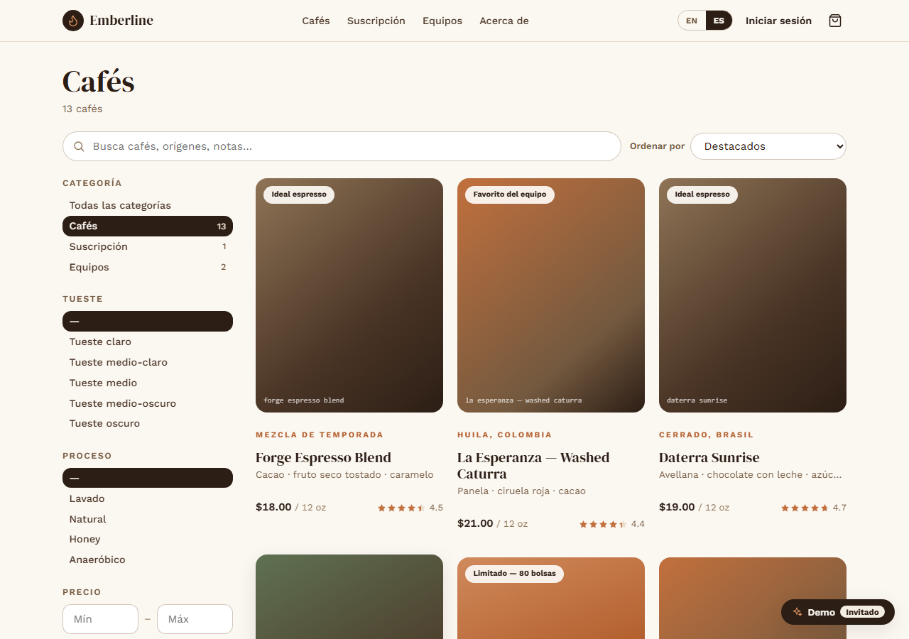
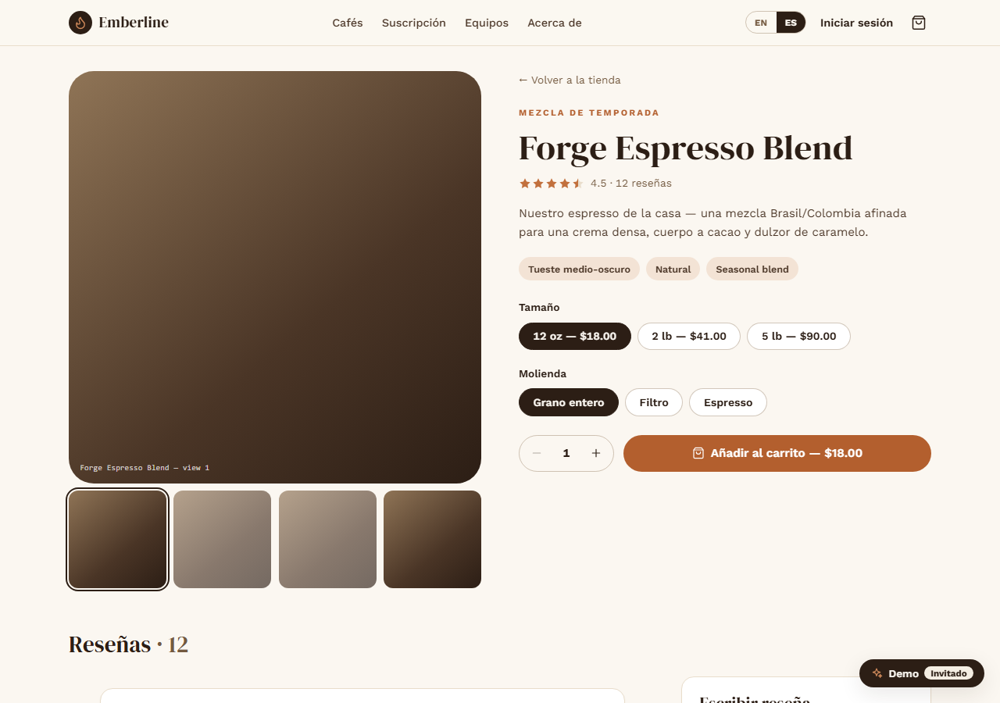
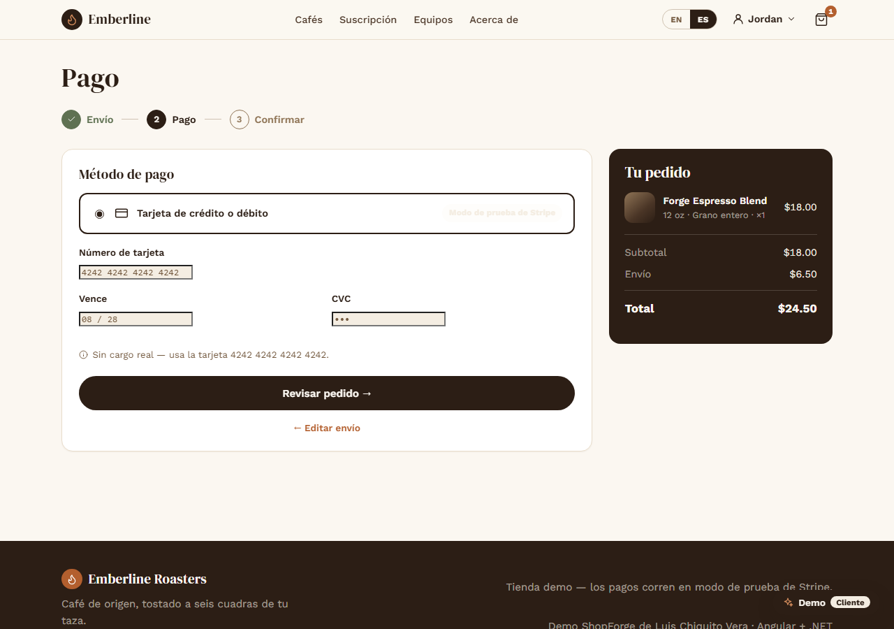
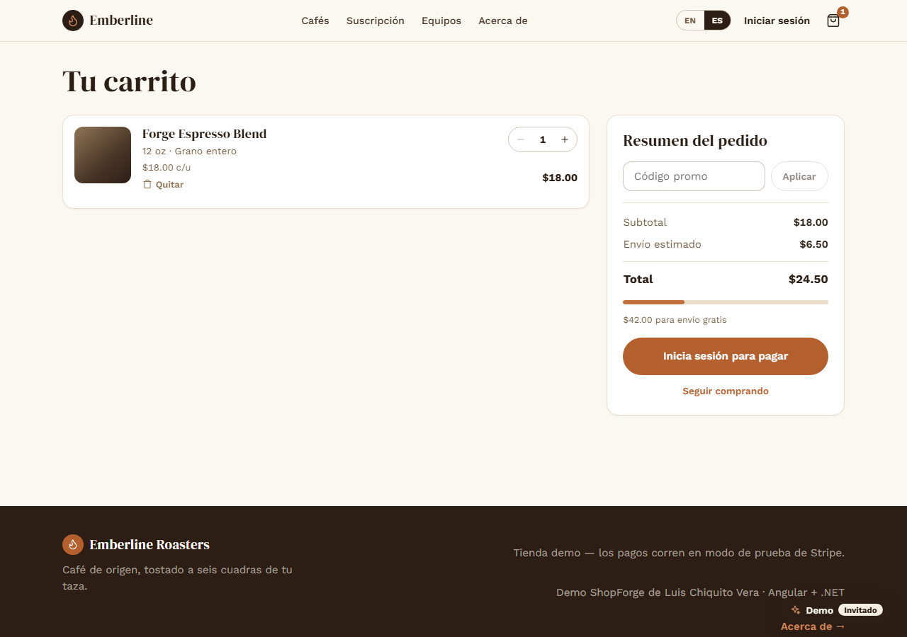
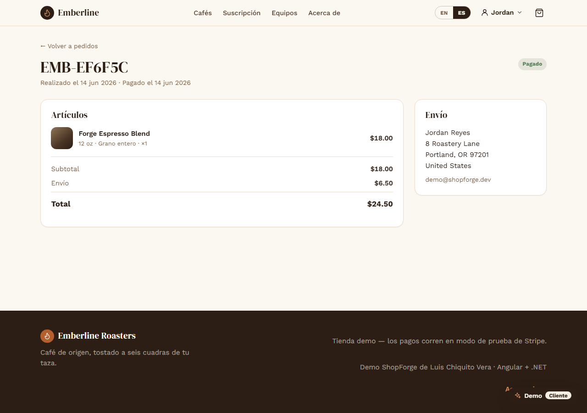
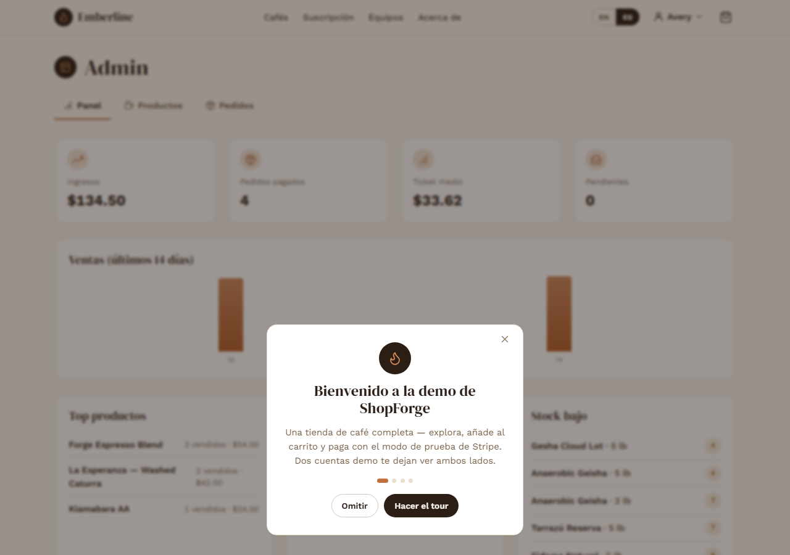

# ShopForge — Emberline Roasters

> A specialty-coffee storefront with a full commerce backend: catalog with filters, cart, Stripe
> checkout, transactional orders, customer accounts and an admin console.
> Angular 20 (standalone + signals) · .NET 9 Clean Architecture · SQL Server · Stripe.

Flagship project #5 of [Luis Chiquito Vera's portfolio](https://github.com/LuisGxz).

**[▶ Live demo](https://luisgxz.github.io/ShopForge)** · **[Technical deep-dive](docs/TECHNICAL.md)** · **[About page](https://luisgxz.github.io/ShopForge/about)**

| | |
|---|---|
| **Storefront** | https://luisgxz.github.io/ShopForge |
| **API** | https://shopforge-api-luisgxz.azurewebsites.net |
| **Demo (customer)** | `demo@shopforge.dev` / `Demo1234!` |
| **Demo (admin)** | `admin@shopforge.dev` / `Admin1234!` |

> The public demo runs the deterministic stub payment gateway, so checkout completes without real
> Stripe keys. The API is on Azure's free tier (F1 + serverless SQL) — the first request after idle
> takes a few seconds while the container and database resume.



## What it does

- **Catalog** — URL-driven filters (category, roast, process, price), full-text search, sort and server-side pagination
- **Product** — size/grind variants, gallery, quantity stepper, wishlist, verified-purchase reviews (one per user, recomputed rating)
- **Cart** — editable lines, coupon validation, free-shipping threshold; **guest cart in localStorage merges into the account on login**
- **Checkout** — three steps (Shipping → Payment → Review) with Stripe Elements or the stub gateway; `intent → confirm` finalizes the order in **one transaction** (stock, coupon, cart, payment — all or nothing, idempotent)
- **Account** — order history with line snapshots + shipping address, wishlist
- **Admin** — sales dashboard (KPIs, chart, top products, low stock), product/variant editor, order fulfilment inbox
- **Cross-cutting** — JWT + rotating refresh + lockout + RBAC, bilingual EN/ES, guided demo (role-aware tour + role badge), loading/empty/error states throughout

## Stack

- **Frontend:** Angular 20 (standalone, signals, OnPush), hand-built SCSS design system (*Emberline*), Stripe.js (loaded dynamically)
- **Backend:** .NET 9 Minimal API, Clean Architecture + service layer, FluentValidation, EF Core 9
- **DB:** SQL Server — rich catalog, variant-level pricing, transactional checkout
- **Payments:** Stripe (test mode) behind an `IPaymentGateway` port — PaymentIntent + Elements + signed webhook, with a deterministic stub fallback
- **Auth:** JWT + rotating refresh tokens + account lockout + RBAC (Customer / Admin)
- **Tests/CI:** 61 unit tests (xUnit, EF Core InMemory) + Playwright E2E + GitHub Actions
- **Deploy:** Azure App Service (F1) + serverless SQL · GitHub Pages

## Run locally

```bash
# DB: local SQL Server (Windows auth) — or:  docker compose up -d
dotnet run --project backend/ShopForge.Api --urls http://localhost:5230   # migrates + seeds demo catalog
npm start --prefix frontend                                                # http://localhost:4200
dotnet test backend/ShopForge.sln                                          # 61 tests
```

Demo accounts (seeded): `admin@shopforge.dev` / `Admin1234!` · `demo@shopforge.dev` / `Demo1234!`

## Architecture

```
backend/
├── ShopForge.Domain/         entities + rules (stock guards, coupon math, Order state machine, cart merge)
├── ShopForge.Application/    services (Catalog/Cart/Checkout/Orders/Admin/Auth), Actor-based RBAC, ports
├── ShopForge.Infrastructure/ EF Core, JWT/PBKDF2, Stripe + stub gateway, OrderFinalizer, seed
└── ShopForge.Api/            Minimal-API endpoints, ForwardedHeaders, rate limiting, Serilog, DI
frontend/                     Angular 20 standalone + signals + SCSS (Emberline design system)
```

See [`docs/TECHNICAL.md`](docs/TECHNICAL.md) for the deep-dive and [`docs/REQUIREMENTS.md`](docs/REQUIREMENTS.md) for the data model and API surface.

## Screenshots

| Catalog | Product | Checkout |
|---|---|---|
|  |  |  |

| Cart | Order detail | Admin dashboard |
|---|---|---|
|  |  |  |
